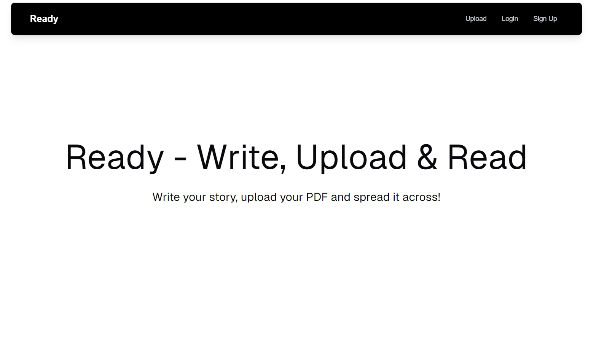

# Ready

Ready is a full stack application where you can upload your PDFs, read them inside the application itself, and find other PDFs uploaded by other users just like you. All you need is a web browser and an 'okayish' network!

## Why?

I have seen many people hesitate when they have to upload their stories online. I want to give them a platform where they can always be "Ready" to upload their books/stories, so that other users can read them too.

On the other hand, users can use this website as a cloud storage for their own documents.

I have tried to make this site completely accessible by allowing keyboard navigation while uploading PDFs and editing them. Moreover, I have added tooltips and alt text for the images wherever possible.

## Capabilities/Features

- User authentication with email, password & Google
- Upload PDF
- Read PDF
- Download PDF
- Edit PDF details
- Delete PDF and details
- Browse the library of PDFs
- Wishlist any PDF
- See user statistics on dashboard (PDFs uploaded, wish listed)
- Dark mode support with system option

## Tech used

- Next.js
- [Pinata](https://pinata.cloud/)
- Appwrite
- shadcn
- Tailwind CSS

## Demo

Here's the live version: [Ready](https://ready-two.vercel.app/)

## Screenshots

### Upload PDF page


### Edit PDF page


### Login page


### Library page - Grid view (User not logged in)


### Library page - List view (User not logged in)


### Library page - List view (User is logged in) on Light theme


### Wishlist page - When there are no wish list items


### Read PDF page


## More Details

<!-- Share clear examples of how you used Pinata. -->

I used Pinata File API on a couple of occasions:

- Upload PDF
- Upload a thumbnail image

Let's look at them below:

### 1. Upload PDF Document with Pinata

```
const uploadDocFile = async () => {
    if (!file) {
      return;
    }

    try {
      setUploading(true);
      const res = await uploadFile(file);
      const url = await res.json();
      setUrl(url);
      setUploading(false);
      if (!!url) {
        toast({
          description: "Document uploaded successfully!",
        });
      }
    } catch (e) {
      setUploading(false);
    }
  };
```

In the above code, when the user clicks on "Upload Document" button, `uploadDocFile` function gets called. This function is responsible for uploading the document to Pinata and get the file URL in return.

#### `uploadFile` function

This function works behind the scenes of the `uploadDocFile` function.

```
import { pinata } from "./config";

export const uploadFile = async (file) => {
  const keyRequest = await fetch("/api/key");
  const keyData = await keyRequest.json();
  const upload = await pinata.upload.file(file).key(keyData.JWT);
  const urlRequest = await fetch("/api/sign", {
    method: "POST",
    headers: {
      "Content-Type": "application/json",
    },
    body: JSON.stringify({ cid: upload.cid }),
  });
  return urlRequest;
};
```

In the above code, 3 things are happening:

- Fetch the API key from Pinata
- Upload the file with the help of the API key
- Get the file URL, so that we can store it in database

#### Fetch the API key from Pinata

To upload files to Pinata, an API key is required. I used Next.js built-in API routes and created a GET request to fetch the API key from Pinata.

```
import { pinata } from "@/utils/config";
import { NextResponse } from "next/server";

export const dynamic = "force-dynamic";

export async function GET(req, res) {
  try {
    const uuid = crypto.randomUUID();
    const keyData = await pinata.keys.create({
      keyName: uuid.toString(),
      permissions: {
        endpoints: {
          pinning: {
            pinFileToIPFS: true,
          },
        },
      },
      maxUses: 1,
    });
    return NextResponse.json(keyData, { status: 200 });
  } catch (error) {
    return NextResponse.json(
      { text: "Error creating API Key:" },
      { status: 500 }
    );
  }
}
```

#### Use the API key to upload file to Pinata

In the `uploadFile` function, I received the key from Pinata. Here, I used that key to upload the PDF to Pinata.

```
const upload = await pinata.upload.file(file).key(keyData.JWT);
```

#### Get the file URL to store in the database

Using Next.js API routes, I created a POST request by sending the `cid` property to the Pinata server and get the signed URL in return. This URL will be stored in the database as well as used to download the PDF document.

```
import { pinata } from "@/utils/config";
import { NextResponse } from "next/server";

export const dynamic = "force-dynamic";

export async function POST(req, res) {
  try {
    const data = await req.json();
    const url = await pinata.gateways.createSignedURL({
      cid: data.cid,
      expires: 500000, // 138 hours
    });
    return NextResponse.json(url, { status: 200 });
  } catch (error) {
    return NextResponse.json(
      { text: "Error creating API Key:" },
      { status: 500 }
    );
  }
}
```

### 2. Upload Image with Pinata

Similarly, I also used Pinata File API to upload thumbnail or cover images for the PDFs using the function below. This function uses the same underlying functions that were used to upload the PDF.

```
const uploadImageFile = async () => {
    if (!image) {
      return;
    }

    try {
      setThumbnailUploading(true);
      const res = await uploadFile(image);
      const url = await res.json();
      setThumbnailUrl(url);
      setThumbnailUploading(false);
    } catch (e) {
      setThumbnailUploading(false);
    }
  };
```

## Conclusion

Ready is a place where you can just sign up or "Continue with Google" to upload your PDF document or read other digital books uploaded by others.

Don't forget to try "Ready"! I need feedback!

If there's any issue with the project, please create an issue on the GitHub repository mentioned in this post or reach out to me on [X: @sumansourabh48](https://x.com/sumansourabh48).

Thank you!

<!-- Team Submissions: Please pick one member to publish the submission and credit teammates by listing their DEV usernames directly in the body of the post. -->

<!-- Don't forget to add a cover image (if you want). -->

<!-- Thanks for participating! -->
